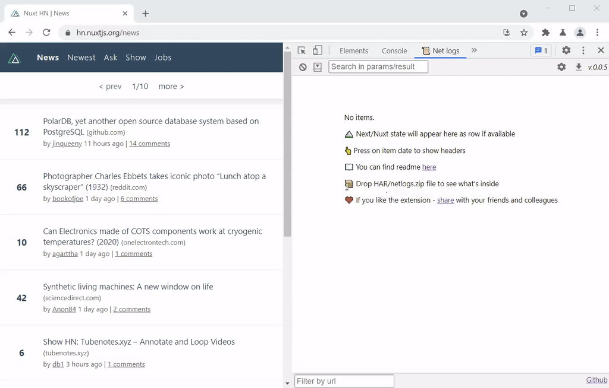

# 📜 Net logs

[Install for Chrome](https://chrome.google.com/webstore/detail/net-logs/cjdmhjppaehhblekcplokfdhikmalnaf)

This is extendable network request viewer extension for Chromium-based browsers.

## 💡 Features

The extension will appear in devtools as a `📜 Net logs` tab.

* 🔍 **Search:** Filter by url and search by params/result.
* ⛰️ **Integration:** View Next.js & NuxtJS hydration state.
* 🛠️ **Customization:** Transform name, parameters, and response with javascript.
* ✨ **Universality:** View live logs or load from [`*.har` file](https://developer.chrome.com/docs/devtools/network/reference/#save-as-har).
* 🤝 **Team-friendly:** Export and share your profile with others.

## 🚀 Installation

You can find a version for Chrome/Edge [here](https://chrome.google.com/webstore/detail/net-logs/cjdmhjppaehhblekcplokfdhikmalnaf).

To install from zip or source, see [local development](#local-development) section.

## ⛰️ [Next.js](https://nextjs.org/) and [NuxtJS](https://nuxtjs.org/) debugging

Extension will pull data from `window.__NEXT_DATA__` or `window.__NUXT__`, if available.

*You can disable this in settings.*

## 🛠️ Configuration

Open the devtools in any webpage, and navigate to "Net logs" tab.
Click the "Options" button to open the **Options page**.

Here you can modify the functions to customize the view.

* Drag and drop your network file to tailor your profile to the logs inside

* Save changes to instantly view the result

* Export finished profile to share with the team

## 🐜Troubleshooting

If something goes wrong and functions crash the view, do the following:

1. [Export a *.har log](https://developer.chrome.com/docs/devtools/network/reference/#save-as-har) from network tab
2. Open options page
3. Drop exported log in the interactive demo
4. Open console

You should see the errors in the console.

Alternatively, you can open a devtools on the devtools.
To do so, undock the devtools and press `Ctrl+Shift+J`, or press right-click and choose `Inpsect`.

This will open new debugger window, where you can find console log with errors.

## 🔐 Security & privacy

All your custom javascript runs in a [sandbox environment](https://developer.chrome.com/docs/extensions/mv2/manifest/sandbox/).

Extension does not transmit any data to the servers.

All settings are stored locally.

## 🤝 Permissions

* `storage` - used to store your custom settings. Does not sync.
* `content_scripts` - used to extract nextjs/nuxtjs data from page.

The list may extend in the future.

## 🚧 Disclaimer

This is software in its early stages of development, which is developed in the free time.
You can report a bug or suggestion in the [Issues tab](https://github.com/Artboomy/netlogs/issues).
I may or may not fix it 😉.

# Local development

## 🏗️ Building

1. Clone `git clone git@github.com:Artboomy/netlogs.git`

2. Install dependencies `cd netlogs && yarn`

3. Build `yarn run build`

4. Enable developer mode in browser at chrome://extensions/ and click **"Load unpacked"** from `dist` folder.

5. You are ready to go! If you don't see the tab in devtools - just reopen it.

6. You can run `yarn run build:watch` for active development. 
   _Hot reload won't work, you'll need to manually reopen devtools on every change._

## 📦 Packaging

Run `yarn run package`. This will generate .zip archive, which can be unpacked and installed as development extensions.

Alternatively, run `yarn run bild:prod` and archive `dist` folder manually.

## 🗜️ Zip installation

1. Grab the latest release from [Github](https://github.com/Artboomy/netlogs/releases). Download `netlogs.zip`.

2. Unzip it.

3. Open chrome://extensions/ and toggle developer mode in the header.

4. Click **"Load unpacked"** and select folder from step 2.

5. You are ready to go! If you don't see the tab in devtools - just reopen it.
