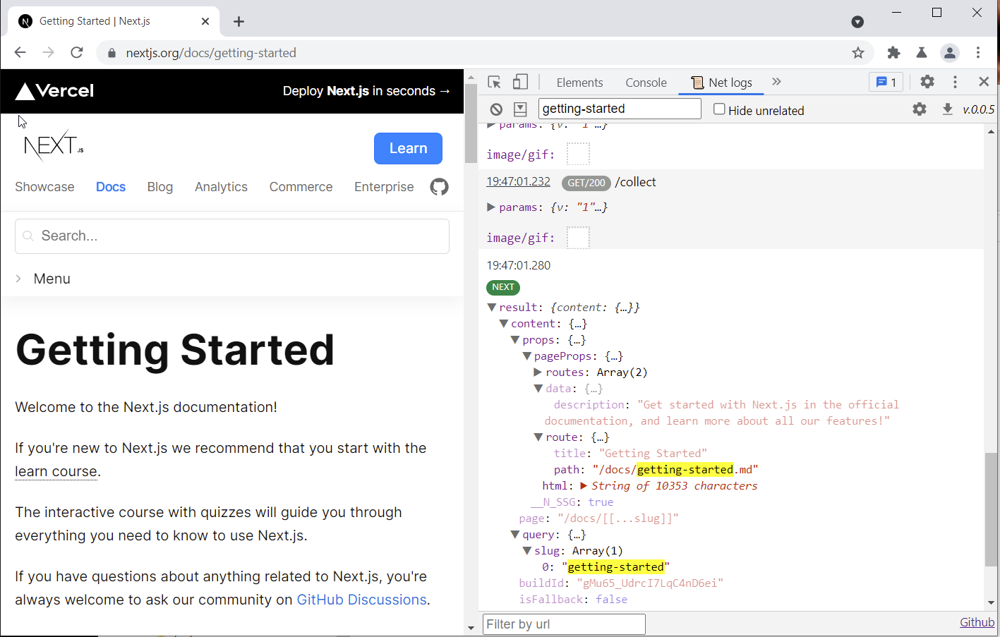

# 📜 Net logs


[](https://twitter.com/intent/tweet?url=https%3A%2F%2Fgithub.com%2FArtboomy%2Fnetlogs&text=%20&hashtags=netlogs%2Cdevtools%2Cdebugging)

[Install for Chrome/Edge](https://chrome.google.com/webstore/detail/net-logs/cjdmhjppaehhblekcplokfdhikmalnaf)

[Web-version to view HAR logs](https://artboomy.github.io/netlogs/)

Better filtering and less clicking than Chrome's Network tab. Built for debugging modern web apps with Next.js/GraphQL support and Jira integration.

## 📖 Table of Contents

- [💡 Features](#-features)
- [🚀 Installation](#-installation)
- [🎨 Presets](#-presets)
  - [GraphQL](#graphql)
  - [JSON-RPC](#json-rpc)
- [🎫 Jira Integration](#-jira-integration)
- [⛰️ Next.js and NuxtJS debugging](#️-nextjs-and-nuxtjs-debugging)
- [💾 Saving and loading logs](#-saving-and-loading-logs)
- [⛓️ Preserve log](#️-preserve-log)
- [🦄 Custom events](#-custom-events)
- [🛠️ Configuration](#️-configuration)
- [🐜 Troubleshooting](#troubleshooting)
- [🔐 Security & privacy](#-security--privacy)
- [🤝 Permissions](#-permissions)
- [🏗️ Development](#️-development)
- [🤝 Attributions](#-attributions)
- [🌐 Translations](#-translations)

## 💡 Features

The extension will appear in devtools as a `📜 Net logs` tab.

* 🔍 **Advanced Search**: Filter requests by URL and search within parameters/results.
* ⛰️ **Framework Integration**: View Next.js & NuxtJS hydration state.
* 🎨 **Protocol Presets**: Streamlined unpacking for GraphQL and JSON-RPC.
* 📡 **WebSocket Listening**: Capture and analyze WebSocket traffic in real-time.
* ✨ **Log Viewing**: Analyze live or import logs from HAR/*.netlogs.zip files.
* 🤝 **Collaboration**: Export and share logs for team debugging.
* 🎫 **Jira Integration**: Create detailed bug tickets in one click with HAR files and screenshots.


## 🚀 Installation

You can find a version for
Chrome/Edge [here](https://chrome.google.com/webstore/detail/net-logs/cjdmhjppaehhblekcplokfdhikmalnaf).

To install from zip or source, see [local development](LOCAL_DEVELOPMENT.md).

## 🎨 Presets

*You can disable presets in the settings.*

### [GraphQL](https://graphql.org/)

Features: query name extraction, result unwrapping, colored tag.


### [JSON-RPC](https://www.jsonrpc.org/)

Features: method extraction, result unwrapping, coloring for error responses.


## 🎫 Jira Integration

Create comprehensive bug reports directly from the extension with a single click. The integration automatically bundles network logs (HAR format), page screenshots, and contextual metadata into a properly formatted Jira ticket.

https://github.com/user-attachments/assets/7abfed92-1da8-4923-b223-4db981ed0f57

**Features:**

* **Automated Attachment**: HAR files and screenshots are automatically attached to tickets
* **Template System**: Customizable ticket descriptions with dynamic variable substitution
* **Metadata Capture**: Includes browser info, page URL, timestamp, and user agent
* **Field Mapping**: Supports custom Jira fields with caching for improved performance
* **One-Click Workflow**: From debugging to ticket creation in seconds

Configure your Jira instance settings (base URL, API token, project key) in the extension options:


*Jira integration works with both Jira Cloud and self-hosted Jira instances. Requires API token (PAT).*

## ⛰️ [Next.js](https://nextjs.org/) and [NuxtJS](https://nuxtjs.org/) debugging




Extension will pull data from `window.__NEXT_DATA__` or `window.__NUXT__`, if available.

*You can disable this in settings.*

## 💾 Saving and loading logs


To export logs, click ⬇️ button in the header.

To load logs, simply drag and drop the file in the extension.

Extension supports `*.netlogs.zip` and `*.har` files.

## ⛓️ Preserve log

If you want to preserve logs on page reload - click `expand` button in the header, then mark checkbox.


## 🦄 Custom events

You can send custom events to extension from page with `window.netlogs` function.

_Note that function might not always be available._

Usage:
`window.netlogs(event)` or `window.netlogs('Hello world')`

Example:

`window?.netlogs({ tag: 'TEST', content: { message: 'Hello world' } }`


Event signature is either `IItemContentOnlyCfg`:

```typescript
type IItemContentOnlyCfg = {
    // by default new Date().getTime() will be used
    timestamp?: number;
    // small bit of text next to date
    tag?: string;
    // viewable on date click
    meta?: {
        key: {
            items: [{ name: string, value: string }]
        }
    }

    content: object | string;
}
```

or `IItemTransactionCfg`

```typescript
type IItemTransactionCfg = {
    // by default new Date().getTime() will be used
    timestamp?: number;
    // small bit of text next to date
    tag?: string;
    name?: string;
    // viewable on date click
    meta?: {
        key: {
            items: [{ name: string, value: string }]
        }
    }

    params: object;

    result: object;
}
```

To get help message in console, invoke `window?.netlogs.help()`.

## 🛠️ Configuration

Open the devtools in any webpage, and navigate to "Net logs" tab. Click the "Options" button to open the **Options
page**.

## 🐜Troubleshooting

If something goes wrong:

1. Reopen the devtools
2. Try to fully close and open browser

If the issue persist -
please [open new bug report](https://github.com/Artboomy/netlogs/issues/new?assignees=&labels=bug&projects=&template=bug_report.md&title=%5BBUG%5D).
Make sure to include *.har file if possible.

## 🔐 Security & privacy

Extension panel runs in
a [sandbox environment](https://developer.chrome.com/docs/extensions/mv2/manifest/sandbox/).

Extension collects anonymous analytics with Google Analytics 4. You can opt out in the Options.

All settings are stored locally.

## 🤝 Permissions

* `storage` - used to store your custom settings. Does not sync.
* `content_scripts` - used to extract NextJS/NuxtJS data from page.
* `contextMenus` - used to extract selected text for search
* `debugger` - used for WebSocket listening.

The list may extend in the future.

## 🏗️ Development

Please see the [dedicated documentation](LOCAL_DEVELOPMENT.md).

## 🤝 Attributions

[Left mouse click icon](https://www.flaticon.com/free-icon/left-click_3645819)

[Middle mouse click icon](https://www.flaticon.com/free-icon/click_3646205)

[Right mouse click icon](https://www.flaticon.com/free-icon/right-click_3645851)

## 🌐 Translations

Translations are LLM-generated. If you are proficient in the language and spot mistakes – feel free to issue a pull 
request with changes.
